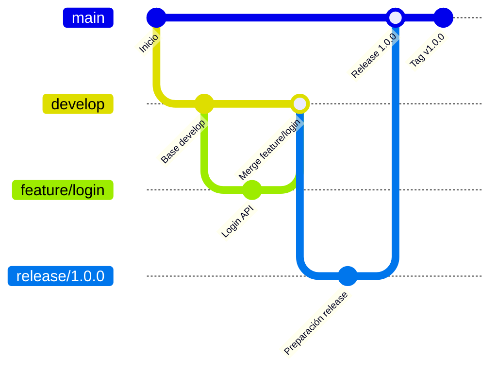
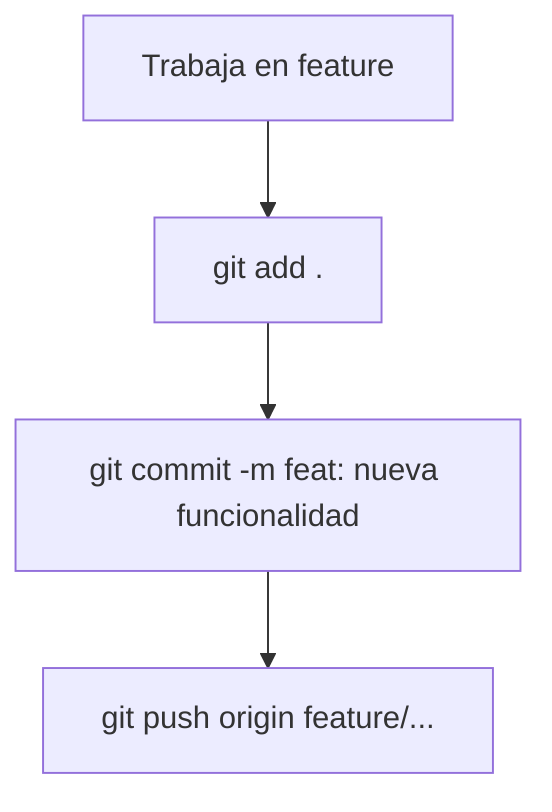
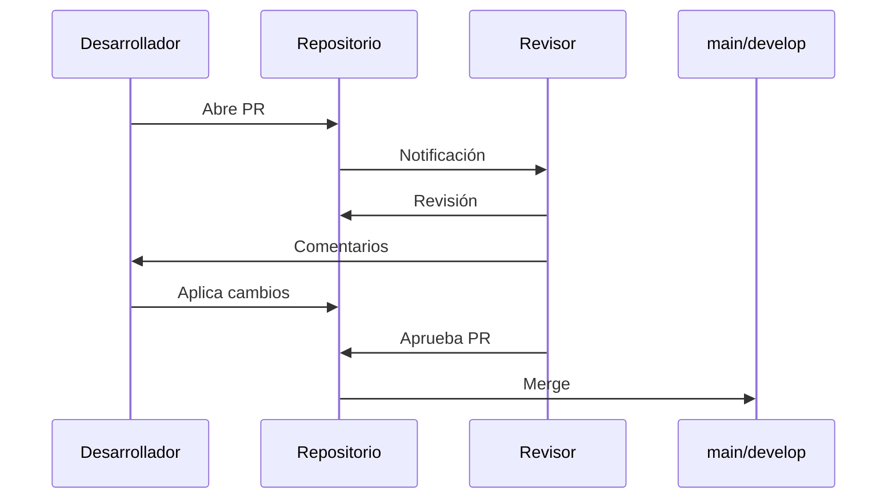
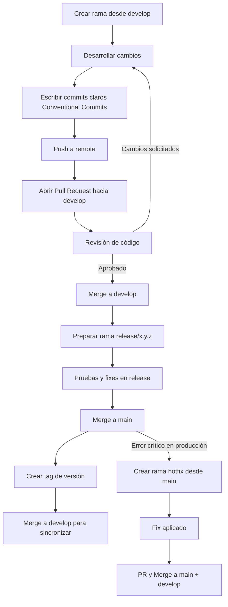

# 🤝 Contribuir al proyecto

Este documento explica las reglas de trabajo en equipo: **flujo de ramas (Git Flow), convención de nombres, commits, Pull Requests y Code Reviews**.

Por favor, **léelo antes de abrir un PR**.

---

## 📌 Flujo de trabajo (Git Flow)

Usamos **Git Flow** como estrategia de ramas.

* `main`: rama estable en producción.
* `develop`: rama de integración para desarrollo.
* `feature/*`: nuevas funcionalidades (desde `develop`).
* `bugfix/*`: correcciones en desarrollo.
* `release/*`: preparación de versiones (desde `develop`).
* `hotfix/*`: correcciones urgentes en producción (desde `main`).

### Ejemplo visual:



---

## 🏷️ Convenciones de nombres

### Ramas

* `feature/nombre-corto-funcionalidad` → `feature/login-api`
* `bugfix/nombre-corto-bug` → `bugfix/fix-jwt-expiration`
* `release/x.y.z` → `release/1.0.0`
* `hotfix/nombre-corto` → `hotfix/fix-prod-db`

### Commits

Usa [Conventional Commits](https://www.conventionalcommits.org/):

```
<tipo>(opcional-alcance): descripción en minúsculas
```

Tipos comunes:

* `feat`: nueva funcionalidad
* `fix`: corrección de bug
* `refactor`: mejora interna
* `docs`: documentación
* `test`: pruebas
* `chore`: tareas de mantenimiento

✅ Correctos:

```
feat(api): agregar endpoint para encuestas
fix(auth): corregir expiración de token JWT
docs: actualizar README con pasos de instalación
```

❌ Incorrectos:

```
update files
fix bug
cambios varios
```

### Flujo de commit



---

## 🔄 Pull Requests (PRs)

1. Abre un **PR hacia `develop`** (excepto `hotfix` → `main`).
2. Usa un título claro con prefijo (`feat:`, `fix:`, etc.).
3. En la descripción incluye:

   * Qué hiciste.
   * Cómo probarlo.
   * Issues relacionados (Opcional).
4. Verifica este checklist antes de abrirlo:

   * [ ] Código compila y funciona.
   * [ ] Tests pasan.
   * [ ] Naming correcto en ramas y commits.
   * [ ] No hay código comentado innecesario.

---

## 👀 Code Review

El **Code Review** es obligatorio antes de hacer merge.

### Como autor

* Solicita revisores.
* Responde comentarios.
* Haz cambios cuando sea necesario.

### Como revisor

* Revisa claridad, buenas prácticas, rendimiento y seguridad.
* Haz comentarios constructivos.
* No apruebes si no cumple los estándares.

### Flujo de revisión



---

## 🚀 Lanzamientos

1. Crea una rama `release/x.y.z` desde `develop`.
2. Haz pruebas y fixes.
3. Haz merge en `main` y `develop`.
4. Etiqueta la versión:

```bash
git tag -a v1.2.0 -m "Release 1.2.0"
git push origin v1.2.0
```

---

# 📖 Ejemplo de flujo real

Imagina que debemos agregar una **funcionalidad de login con JWT** al proyecto.
Aquí te muestro cómo sería el proceso paso a paso usando Git Flow:

---

## 1️⃣ Crear la rama de la funcionalidad

Desde `develop`, el desarrollador crea su rama:

```bash
git checkout develop
git pull origin develop
git checkout -b feature/login-jwt
```

📄 **Naming aplicado**: `feature/login-jwt`

---

## 2️⃣ Hacer cambios y commits claros

El desarrollador implementa la lógica de login y realiza commits con [Conventional Commits](https://www.conventionalcommits.org/):

```bash
git add .
git commit -m "feat(auth): agregar endpoint de login con JWT"
git commit -m "test(auth): añadir pruebas unitarias para el login"
git push origin feature/login-jwt
```

---

## 3️⃣ Abrir un Pull Request

En GitHub, abre un **PR hacia `develop`** con:

* **Título:**
  `feat(auth): implementar login con JWT`

* **Descripción:**

  ```
  Se agrega el endpoint POST /api/login que genera un token JWT
  - Validación de usuario y contraseña
  - Generación de token JWT con expiración de 1h
  - Pruebas unitarias incluidas

  Cómo probar:
  1. Levantar el servidor
  2. Hacer POST a /api/login con usuario válido
  3. Verificar que retorna token válido
  ```

---

## 4️⃣ Code Review

El revisor entra y deja comentarios:

💬 **Revisor:**

> "Buen trabajo! Solo sugiero extraer la lógica de generación de token a un helper para mejorar legibilidad."

El autor aplica el cambio y actualiza el PR:

```bash
git commit -m "refactor(auth): mover generación de token a helper"
git push origin feature/login-jwt
```

---

## 5️⃣ Merge a `develop`

Cuando el revisor aprueba, el PR se hace **merge a `develop`**.

---

## 6️⃣ Preparar un release

Cuando se acumulan varias funcionalidades, se crea una rama de release:

```bash
git checkout develop
git checkout -b release/1.1.0
```

Se hacen pruebas y ajustes, luego se mergea a `main` y `develop`, y se etiqueta:

```bash
git checkout main
git merge release/1.1.0
git tag -a v1.1.0 -m "Release 1.1.0"
git push origin main --tags
git checkout develop
git merge release/1.1.0
```

---

## 7️⃣ Caso de un bug en producción

Imagina que el token JWT expira demasiado rápido en producción.
Creamos un **hotfix** desde `main`:

```bash
git checkout main
git checkout -b hotfix/fix-jwt-expiration
```

Commit del fix:

```bash
git commit -m "fix(auth): corregir tiempo de expiración del token JWT"
git push origin hotfix/fix-jwt-expiration
```

Se abre un PR hacia `main` y tras aprobarse:

```bash
git checkout main
git merge hotfix/fix-jwt-expiration
git tag -a v1.1.1 -m "Hotfix JWT expiration"
git push origin main --tags
git checkout develop
git merge hotfix/fix-jwt-expiration
```

---

## ✅ Resumen

* Usa **Git Flow**.
* Aplica **naming consistente** en ramas y commits.
* Escribe **commits claros** (Conventional Commits).
* Crea **PRs bien documentados**.
* Realiza y responde **Code Reviews**.
* Publica versiones con **tags**.

## 🔎 Diagrama de flujo completo

Este diagrama resume todo el ciclo de vida de las contribuciones:


